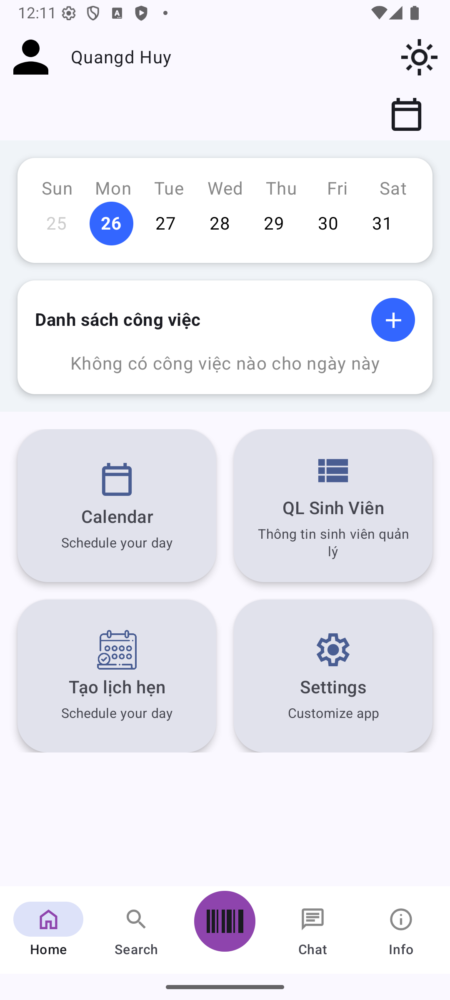

# Ứng dụng hỗ trợ cố vấn học tập trong Học viện Kỹ thuật Mật Mã

Ứng dụng cung cấp những chức năng tiện ích giúp cho cố vấn học tập trong học viện có thể dễ dàng quản lý các sinh viên thuộc quyền quản lý.

## Các chức năng cơ bản:

- Đăng nhập / Đăng kí
- Quản lý nhiệm vụ
- Quản lý cuộc hẹn
- Quản lý trò chuyện
- Cài đặt
- Xem thông tin cá nhân

## Demo

  
  

  <i>Giao diện Đăng ký (trái) và Đăng nhập (phải)</i>

   
  <i>Giao diện Home</i>

   
  <i>Giao diện Home</i>

   
  <i>Giao diện Calendar</i>

  
  
  

  <i>Giao diện Cuộc hẹn của sinh viên và cố vấn</i>

  
  

  <i>Giao diện Nhắn tin</i>

  
  

  <i>Một vài giao diện khác trong ứng dụng</i>

